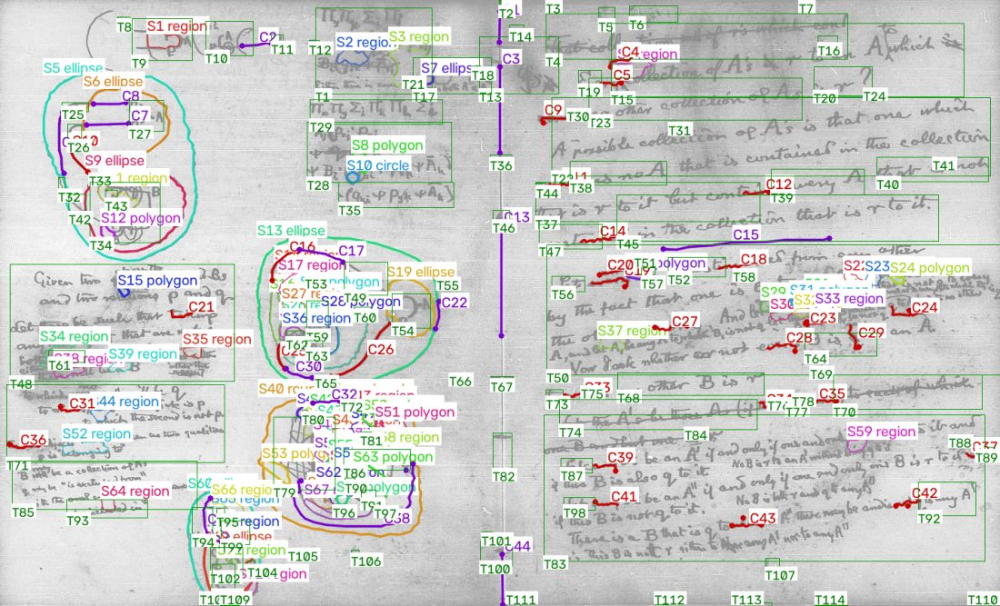
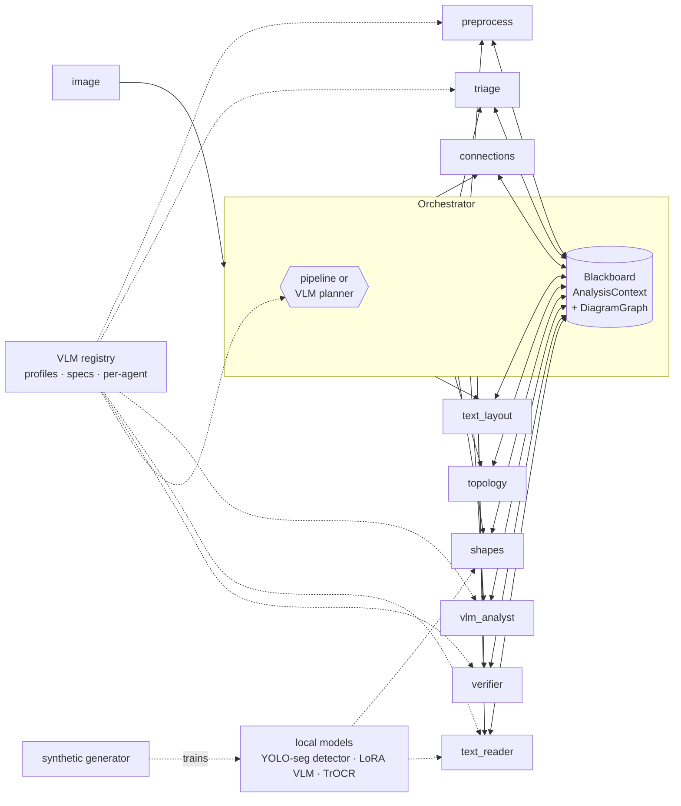
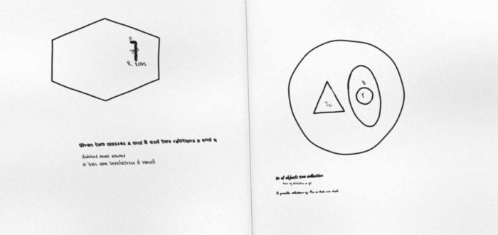
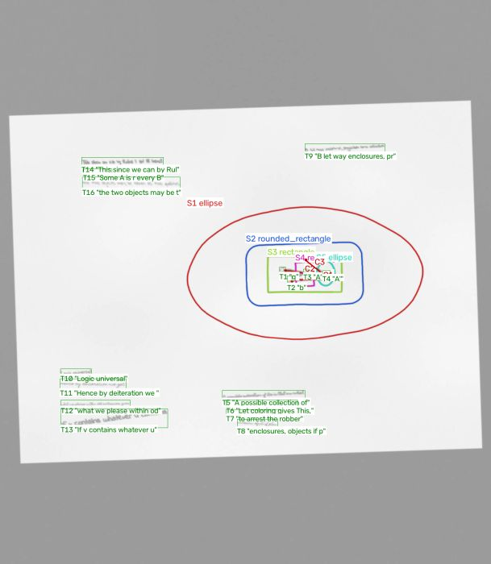
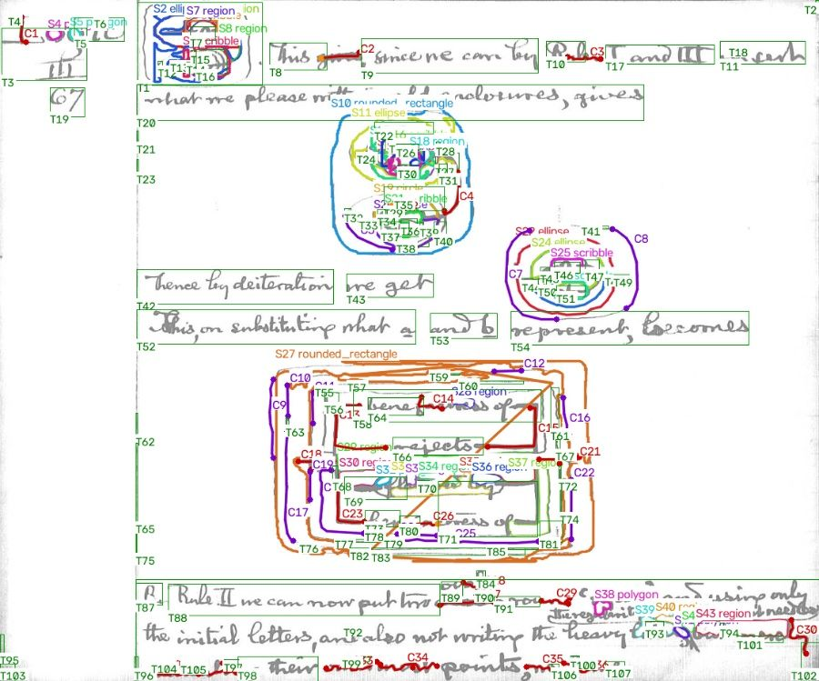

# identify_drawing_from_image

Agentic pipeline that looks at a picture and works out whether it contains a **hand drawing**. If it does, it identifies:

* **which shapes** are drawn: ellipse, circle, rectangle, rounded rectangle, triangle, diamond, polygon, an irregular closed region or a scribble
* **how the shapes relate**: nesting (which shape contains which, to any depth), overlaps and touching outlines
* **how they are connected**: lines, arrows and heavy "lines of identity", including what each line end is attached to and which outlines it crosses
* **what is written inside and near each shape**, and labels written on lines

The examples in [`examples/images`](examples/images) are scans of Charles S. Peirce's logic notebooks (existential graphs). They cover the hard cases: microfilm frames, two-page spreads, ruled and stained paper, pages rotated by 90°, nested ovals crossed by heavy lines, crossed-out words and scribbles.

Classical computer vision does the geometry, a **pluggable VLM** of your choice (Claude, GPT, Gemini, Ollama, vLLM/LM Studio, local HuggingFace models, or none at all) does the reading and judging, and **local models trained on synthetic images** fill the gaps.



*Classical CV pass only, no VLM: nested ovals (S#), heavy lines and connectors (C#), and text regions (T#) to be read.*

---

## Architecture



Agents never call each other. They read and write a shared **blackboard** (the `AnalysisContext` with the `DiagramGraph` being built), and the **orchestrator** decides who runs next:

* `pipeline` mode (default) runs a fixed plan, then a **verification loop**. The verifier VLM sees the drawing next to a numbered overlay of the current detections ("set-of-marks"), corrects them, and can ask agents to re-run (for example, a relaxed shape re-scan or a re-read of the text).
* `planner` mode lets a VLM pick the next agent at every step, based on the blackboard state, the agent descriptions and the history. Invalid or premature choices fall back to the default plan, so a weak planner can't break the run.

| agent | does | uses |
|---|---|---|
| `preprocess` | finds the page in a microfilm frame, fixes the orientation (classical guess, confirmed by the VLM), flattens stains and lighting, binarises the ink, removes ruled lines and gutters | CV + VLM |
| `triage` | decides whether the image is a hand drawing or diagram rather than a photo or plain text | CV + VLM |
| `shapes` | finds closed outlines (enclosed areas, merged when lines cut them, plus filled outlines for cluttered interiors; pen gaps are bridged) and classifies them by IoU against fitted primitives. Can fuse a locally trained YOLO-seg detector | CV + local model |
| `connections` | erases outlines, separates connectors from handwriting by skeleton statistics, extracts heavy lines of identity by stroke width, detects arrow heads, and re-joins lines cut at outlines | CV |
| `text_layout` | groups the remaining ink into words and lines without crossing outlines | CV |
| `topology` | computes direct containment and depth, overlaps and touching shapes, inside/near placement of text, line-end attachment (text, outline, interior or free), crossed outlines and line labels | geometry |
| `vlm_analyst` | holistic VLM reading of the whole page, fused with the geometry: confirms or corrects types and adds missed shapes, texts and connections | VLM |
| `text_reader` | transcribes every text region from crops (batched, or a labelled sheet for single-image VLMs), or with local TrOCR or Tesseract | VLM / OCR |
| `verifier` | set-of-marks critique: remove, retype or add shapes, fix transcriptions, add or remove connections, request re-runs | VLM |

Without any VLM the classical agents still produce a full structural graph: shapes, nesting, connections and text locations. Only the transcriptions are missing.

## Install

```bash
pip install -e .                    # core: numpy, opencv, scikit-image, scipy, pydantic, pyyaml
pip install -e '.[anthropic]'       # + Claude      (or [openai], [gemini])
pip install -e '.[hf]'              # + local HuggingFace VLMs / LoRA fine-tuning
pip install -e '.[yolo]'            # + the local detector (ultralytics)
pip install -e '.[ui]'              # + web UI (gradio)
pip install -e '.[all,dev]'
drawid fonts                        # free handwriting fonts for the synthetic generator (Google Fonts, OFL)
```

## Quick start

```bash
drawid analyze examples/images/robber_policeman_graph.jpg --vlm claude --print
drawid analyze examples/images/ --no-vlm --out outputs/        # classical CV only
drawid ui                                                      # web UI with VLM drop-downs
```

Each image produces the following in `--out`:

| file | content |
|---|---|
| `NAME.json` | the full `DiagramGraph`: shapes, connections, texts, relations, agent trace |
| `NAME_overlay.png` | detections drawn over the page |
| `NAME.md` | plain-English structure, agent trace, Mermaid diagram |
| `NAME.dot` / `NAME.mmd` | Graphviz (nested clusters) and Mermaid exports |
| `NAME_working.png` | the cropped/rotated page that all coordinates refer to |

Python:

```python
from drawing_identifier import analyze, Orchestrator, load_config

res = analyze("page.jpg", vlm="ollama:qwen2.5vl:7b")
for s in res.graph.shapes:
    print(s.id, s.type.value, "inside", s.parent_id, "texts:", [res.graph.text(t).text for t in s.text_inside])
for c in res.graph.connections:
    print(c.id, "heavy" if c.heavy else c.type.value, "joins", c.attached_ids(), "crossing", c.crosses)
```

## Choosing the VLM

```bash
drawid vlms        # profiles, providers, and which ones are usable right now (keys / servers found)
drawid agents --vlm claude --agent-vlm text_reader=ollama-qwen   # who would use what
```

* **Profiles.** `claude`, `claude-sonnet`, `claude-haiku`, `gpt`, `gemini`, `ollama-qwen`, `ollama-llama`, `vllm-qwen`, `hf-qwen`, `local-finetuned` and `mock`. Add your own in a YAML file (see [`configs/example.yaml`](configs/example.yaml)).
* **Ad-hoc specs.** `provider:model[@base_url]`, for example `anthropic:claude-opus-5-5`, `openai:gpt-5`, `gemini:gemini-2.5-pro`, `ollama:qwen2.5vl:7b@http://gpu-box:11434`, `vllm:Qwen/Qwen2.5-VL-7B-Instruct`, `lmstudio:<model>`, `openrouter:<model>` or `hf:Qwen/Qwen2.5-VL-3B-Instruct`.
* **`auto`** (the default) picks the first usable entry in `auto_preference`. **`none`** runs classical CV only.
* **Per agent.** Use `--agent-vlm verifier=claude --agent-vlm text_reader=ollama-qwen`, or `agent_vlms:` in the config. For example, a cheap local model can read hundreds of crops while a strong model verifies and plans. `planner` is a valid agent name too.
* **Web UI.** `drawid ui` has a global VLM drop-down (or a custom spec) and per-agent drop-downs.
* Each profile also sets `max_image_side`, `max_images_per_call`, `bbox_format` (`xyxy_1000`, `yxyx_1000` or `xyxy_pixels`), `temperature`, `max_tokens` and `extra` (request parameters, `adapter_path` for LoRA weights, `device_map`, `dtype` …).

API keys are read from environment variables (`ANTHROPIC_API_KEY`, `OPENAI_API_KEY`, `GEMINI_API_KEY`, or the profile's `api_key_env`). Never put keys in config files.

## Synthetic training data

 

`drawing_identifier/synthetic` renders pages from a random **scene graph** modelled on the examples:

* **shapes:** nested containers ("cuts") up to depth 4, laid out concentrically or side by side; ellipses, circles, rectangles, rounded rectangles, triangles, diamonds and polygons; Venn-style overlaps
* **hand-drawn look:** smooth wobble, pen lifts, overshoot and small gaps where the outline closes, varying pen pressure
* **labels:** inside shapes (letters, subscripts, predicate words from Peirce's notebooks) and next to them
* **connections:** heavy lines of identity between labels (curved or elbowed, some branching into three ends, some dangling), shape-to-shape lines and arrows, and arrows between diagrams
* **distractors:** paragraphs of handwriting (20 handwriting fonts, or pen-restroked OpenCV fonts), crossed-out lines, scribbles over shapes, bleed-through from the back of the page
* **paper and scanning:** ruled paper with margins, two-page spreads with a gutter, stains, microfilm frames, skew, 90° rotations, grayscale or high-contrast film, blur, noise and JPEG artefacts

The ground truth is exact, because the generator knows what it drew. Every page comes with a full `DiagramGraph`: polygons, nesting, text with transcriptions and placement, and connections with their attached ends.

```bash
drawid synth --preview 6 --out outputs/preview          # look at a few pages + ground-truth overlays
drawid synth -n 5000 --out data/synth --workers 8       # ~0.35 s/page/core
```

| output | for |
|---|---|
| `images/{train,val}`, `annotations/{train,val}/*.json` | everything (ground-truth graphs) |
| `labels/` + `data.yaml` | **YOLO-seg** detector (11 classes: 7 shape types, scribble, line, arrow, text) |
| `coco_{train,val}.json` | any COCO instance-segmentation trainer (Detectron2, MMDet …) |
| `vlm_{train,val}.jsonl` | **VLM fine-tuning**: chat samples whose answer is exactly the JSON the `vlm_analyst` agent asks for |
| `ocr/{train,val}` + `.tsv` | handwriting crops with transcriptions (TrOCR-style fine-tuning) |

## Training the local models

```bash
# 1. shape / line / text detector (YOLO-seg). CPU works for small runs; use a GPU for real ones
drawid train-detector --data data/synth/data.yaml --epochs 50 --imgsz 1024 --device 0
drawid analyze page.jpg --detector cv+yolo --weights models/detector.pt

# 2. a local VLM that speaks the agents' JSON (LoRA on Qwen2.5-VL by default; needs a GPU)
drawid finetune-vlm --data data/synth --base Qwen/Qwen2.5-VL-3B-Instruct --out runs/vlm-lora
drawid analyze page.jpg --vlm local-finetuned          # profile points at runs/vlm-lora
```

## Evaluating and comparing VLMs

```bash
drawid eval --data data/synth --split val --limit 50 --no-vlm
drawid benchmark --data data/synth --vlm none --vlm claude --vlm ollama-qwen --vlm local-finetuned --limit 30 --report outputs/bench.md
```

Predictions are mapped back to the original pixel coordinates (undoing crop, scale and rotation) and matched to the ground truth. The benchmark reports:

* shapes: precision, recall and F1 (mask IoU ≥ 0.5, Hungarian matching), plus exact and family type accuracy
* containment F1
* text: detection F1, CER and exact-match rate, and accuracy of "inside which shape"
* connection F1, on the pairs of elements each line joins
* seconds per image

### Results so far

Held-out synthetic pages: 50 validation pages of a 500-page set, with no VLM. The local detector is a YOLO11n-seg trained for 30 epochs on the 450 training pages, on CPU at 800 px (about 2.5 h on 4 cores):

| system | shapes P/R/F1 | type acc | family acc | containment F1 | texts F1 | text CER | inside acc | connections F1 | s/img |
|---|---|---|---|---|---|---|---|---|---|
| classical CV | 0.89/0.85/0.87 | 0.91 | 0.95 | 1.00 | 0.66 | - | 0.96 | 0.17 | 0.60 |
| CV + local YOLO | 0.90/1.00/0.95 | 0.91 | 0.95 | 0.98 | 0.67 | - | 0.93 | 0.21 | 1.00 |
| local YOLO only | 0.99/0.99/0.99 | 0.91 | 0.96 | 0.90 | 0.66 | - | 0.77 | 0.23 | 0.82 |

* The trained detector closes most of the classical detector's gaps on shapes: recall goes from 0.85 to 1.00 with `cv+yolo`.
* Classical outlines give tighter polygons and therefore better nesting, which is why `cv+yolo` is recommended over `yolo` alone.
* Reading the text (CER) and connections need a VLM. Without one, the text is located but not read.

The detector also transfers to the real scans. On `rotated_nested_rectangles.jpg`, `cv+yolo` finds the large nested rounded rectangles and nested ovals that the classical pass alone misses. It also fires a few false "scribble" detections:



To reproduce:

```bash
drawid synth -n 500 --seed 7 --out data/synth500
drawid train-detector --data data/synth500/data.yaml --epochs 30 --imgsz 800 --device cpu
drawid benchmark --data data/synth500 --vlm none --limit 50 --detector cv+yolo --weights models/detector.pt
```

## Output schema (abridged)

```json
{
  "image": {"width": 1427, "height": 865, "rotation": 0, "crop": {...}, "scale": 1.0, "stroke_width": 1.8},
  "is_drawing": true,
  "shapes": [{"id": "S5", "type": "ellipse", "bbox": {...}, "polygon": [[x, y], ...], "parent_id": null, "depth": 0,
              "text_inside": ["T25"], "text_near": ["T9"], "crossed_out": false, "confidence": 0.92, "source": ["cv", "vlm"]}],
  "connections": [{"id": "C3", "type": "line", "heavy": true, "path": [[x, y], ...],
                   "endpoints": [{"point": [x, y], "text_id": "T25", "shape_id": "S6", "attachment": "text"}, ...],
                   "crosses": ["S6"], "label_ids": []}],
  "texts": [{"id": "T25", "text": "loves", "placement": "inside", "inside_shape_id": "S5", "near_shape_ids": ["S6"], "crossed_out": false}],
  "relations": [{"type": "contains", "subject": "S5", "object": "S6"}, {"type": "connected", "subject": "T25", "object": "T27", "via": "C3"}],
  "summary": "...", "notes": [...], "trace": [{"step": 3, "agent": "shapes", "message": "...", "seconds": 1.8}]
}
```

## Limitations

* The classical shape detector is a high-precision **proposal generator**. Outlines with large pen gaps, heavily crossed nested rectangles, or ovals buried under text are often missed or come out as `region`. That is what the VLM agents and the trained detector are for.
* Telling handwriting from connectors geometrically is hard when lines touch letters. Connection recall without a VLM is low.
* Without a VLM, text is located but not read (`--ocr trocr` gives a local alternative).
* The VLM fine-tuning script is written for Qwen2.5-VL-style processors and needs a GPU. It was not run end to end in this repository's CI environment (no model download access).

## Project layout

```
drawing_identifier/
  agents/        base (Agent, blackboard), perception agents, VLM agents, orchestrator (pipeline + planner)
  vision/        preprocess, shapes, lines, text_layout, topology, geometry
  vlm/           backends (anthropic, openai/compatible, gemini, ollama, hf, mock) + registry
  synthetic/     hand-drawing primitives, handwriting, scene generator, dataset exporters
  training/      YOLO detector training/inference, VLM LoRA fine-tuning
  export/        overlay renderer, DOT / Mermaid / text description
  evaluation.py  metrics, coordinate mapping, VLM benchmark
  prompts.py     prompts + the JSON contract shared by agents and fine-tuning data
  cli.py, ui.py
configs/example.yaml   examples/images   scripts/download_fonts.py   tests/
```

```bash
pytest          # 38 tests, ~40 s; a scripted mock VLM exercises the whole agent loop
```
